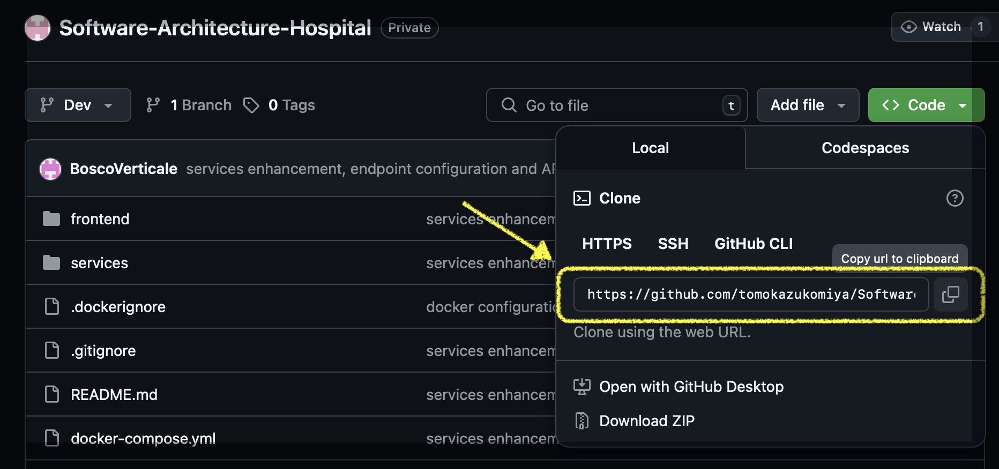

# 🏥 Hospital Emergency Room Management System

## 📃 Overview
A comprehensive Django-based management system for hospital emergency departments, designed to streamline patient flow from triage through treatment to discharge or admission.

## 💻 Key Architecture Characteristics
- **Deployability**: the system is designed for quick and seamless updates. Continuous Integration and Continuous Deployment is achieved with the use of GitHub, which also allows testing and deployment. Docker containers ensure consistent environments across development,
staging and production.
- **Reliability**: the system availability is critical for hospital operations. Redundant servers and database replication will be implemented to ensure 99% uptime.
- **Fault tolerance**: the system continues functioning despite hardware or software failures. Redundant systems and fail over mechanisms are implemented.
- **Simplicity**: the system is designed for ease of understanding and maintenance. Clear documentation and a modular design ensure that developers can quickly understand and update
the system.
- **Modularity**: the system has been built using a microservices architecture, with separate components for user management, data storage, and monitoring. API-driven interactions ensure that modules can be updated independently.
- **Testability**: the system is thoroughly tested to ensure functionality before deployment.

## 📌 Microservices Architecture
Each service handles a specific responsibility:
- **Auth Service** — it manages user registration and login in the system
- **Inventory Service** — it manages the inventory stock of medical instruments in the system
- **Patient Service** — it manages a patient registration into the system with a complete demographic and medical history tracking, with the possibiliti of adding a discharge procedures with prescription management
- **Staff Service** — it manages doctors, nurses and other emergency staffing registration into the system with a role-based access and shift tracking
- **Visit Service** — it manages visits creation besed on the patients previously inserted into the system


## ❗ System Requirements
- Python 3.8+
- Django 3.2+
- PostgreSQL 12+ (recommended)
- Redis (for caching, optional)

## ⚙️ Installation of the project 

Here you can find a comprehensive guide, with attached images, on how to properly install the application.

1. **Clone the repository**
 ```
git clone https://github.com/tomokazukomiya/Software-Architecture-Hospital.git
```

2. **Run the Docker image**
```
   docker-compose up --build
```
> Make sure you have Docker installed and running, otherwise you can download it from the [Docker Website](https://www.docker.com/get-started/).
      
3. **Connect to the application**

You can connect to the application via [the application portal](http://localhost:3000).
Each service will start respectively in the following ports:

|Service|Port|
|-------|----|
|Auth Service|8000:8000|
|Inventory Service|8001:8001|
|Patient Service|8002:8002|
|Staff Service|8003:8003|
|Visit Service|8004:8004|

4. **Testing**

You can test the application by running the following cURL in the terminal. These command line tools are used to transfer data with URLs, primarily for making HTTP requests to APIs in order to retrieve significant information. You can find the complete list of cURLs in the cURL file.
## ❗ Attention
> The project might not be able to properly execute if one of the port in which it runs it already in use. In order to see what processes are running in the port, execute the command:
```
sudo lsof -i:YourPort
```
> If the port is already occupied, copy the PID of the process(es) that is running and execute the command:
```
sudo kill -9 PIDofTheProcess
```

## ⚙️ Guided project installation with images
In order to properly understand the project installation, here it is a guided installation which provides images descriptions

1. **Clone the repository**

Copy the link that you find in the repository webiste in order to clone the repository.


2. **Run the command**

Run the command in the application terminal


3. **Application running in Docker**

You can now see the application running with each service in a specific port.


4. **Testing with cURLs**

You can run the cURLs present in the file to test some of the application features. These are a few examples.
- User registration test

- Login test

- User Details test


